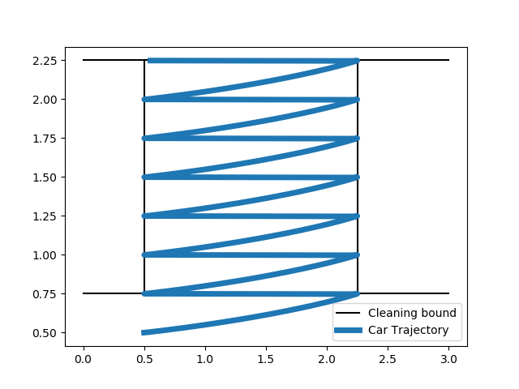

# Introduction: Vacuum PiCar

I wrote an architecture-first system for the PiCar Vacuum which can "clean" a specific patch of floor with performance guarantees. Some salient features include:

1. One-to-one mapping of modules. Each module in the architecture diagram has a corresponding python module. The contents of each module may seem strange at first, but they map nicely onto the architecture and its interface.
2. (Much) Better localization. I've simplified and improved the localization module. The performance improvement can be clearly seen in the video.
3. Concurrent image processing. It takes ~0.5s to capture images and scan QR codes. This caused issues like the timestep for updating position estimates to be too large. Previously, they were sidestepped inelegantly: scanning every 5-10 timesteps. Now that is done by a separate process (finally!), and the overall system is much smoother as a result.
4. Better design. Previously, my bicycle model not only dealt with the Kinematics but also calculated the control inputs and a few other things. Similarly, many classes performed moteley tasks. Now, each class/module has only one logical function.
5. Well-tuned controller. I use the "Moving to a Pose" controller in Peter Corke's [Robotics, Vision and Control textbook](http://petercorke.com/wordpress/books/book). The K-values are pretty well-tuned and the car moves smoothly.

This report turned out to be a bit longer than I expected (it has many pictures!). If you are short on time, you can skip the (sub)sections marked with an asterisk (*).

# Architecture

The architecture is similar to the layered [subsumption architecture by Rodney Brooks](http://mrsl.rice.edu/sites/mrsl.rice.edu/files/BehaviorSystem.pdf). The basic idea behind this architecture is to divide the functionality of the robot into "layers", with functionalities from higher layers subsuming (overriding) those from lower layers.

## Design Principles

I have tried to incorporate many design priciples from Brooks's subsumption paper:

1. Requirements.
    1. Multiple goals: I have different modules that can have conflicting goals (moving forward-and-left, moving in reverse) but they are always appropriately resolved.
    2. Robustness: My system is divided into two levels. Even if for some reason level 1 stops functioning, the robot will still continue its vacuuming and cleaning.
2. Simplicity. I just have two key behaviours (forward-left and reverse-y) with which I can provide a performance guarantee.
3. Using visual data (I had no choice in the matter!).
4. Levels of competence. My robot has two levels of competence (level 0 and level 1). Though the exact function of my levels are a bit different.
5. Layers of control/subsumption. Level 1 behaviours subsume the move_around behaviour from level 0.

The reasons for choosing the trajectory that I did can be seen a [following section](https://github.com/aayn/vacuum-picar#advantages-of-this-trajectory).

## Interface

The interface implementation of the architecture can be seen in [arch_interface.py](arch_interface.py). If there's only one code file you'll look at, let this be the one. It has a comment for every line and explains how the architeture maps onto the implementation.

## Modules Description*

1. `camera`: Captures image from camera and returns it as output.
2. `qr_decoder`: Takes in camera images. Decodes detected QR codes to get their distance, angle and shape.
3. `vacuum`: Sucks in the dust.
4. `move_around`: Returns random heading and speed to move slowly in a random direction.
5. `collide`: Takes in distance to nearest obstacle and returns a halt command (0 speed and 0 steering angle) if it is closer than `IMMINENT_COLLISION`.
6. `bicycle`: Takes in heading/speed as input and returns updated pose as output. Also interacts with the robot's servos and motors.
7. `localizer`: Takes in obstacle size, distance and angle as input and returns pose of the robot.
8. `pose_estimator`: Keeps track of the robot's current pose. Takes in pose estimates from the `bicycle` and the `localizer` and combines them. Returns updated pose.
9. `fwd_left`: Takes in current pose and a short-circuited connection from the `qr_decoder` module. Returns a goal in forward (+y) and left direction.
10. `reverse_y`: Takes in current pose and a short-circuited connection from the `qr_decoder` module. Returns a goal in backward (-y) direction.
11. `goal_executive`: Takes in a goal as input. Calculates and returns the speed and steering angle necessary to reach the goal.
12. `terminator`: Takes in current pose as input. Ends the run if the final goal is reached.

# Key Behaviours and Operation Manual

The two key behaviours I have are forward-left and reverse-y. Each of them takes in the current pose estimate and distance to the forward boundary. The robot is facing the forward boundary at all times. Ignoring many nuances, the PiCar Vacuum works as follows:

1. Suppose that you want to clean a rectangular patch of floor as shown in the figure above. You need to give the lower-left point of the patch and the end point (final goal) as the input. Note that this end point must be the top-left point of the patch.
2. Place the robot 0.25m below the lower-left point, facing in the direction as shown in the figure.
3. Start the robot using `python arch_interface.py`.
4. The robot moves forward and left until it is too close to the forward boundary. In reality, it works using both the distance from the boundary and the position estimates.
5. Then it moves backward until it is too far from the forward boundary.
6. This is repeated until the robot reaches the end point.

The essence of the operation can be summarized by the following state diagram (though, like I said earlier, it's a little more complicated in reality).

# Demonstration

The video demonstration can be found [here](https://youtu.be/1CVKemUw76E).

# Performance Guarantee

The ideal trajectory corresponding to the video can be seen in the figure above. And the figure below shows the plot which accounts for the PiCar's thickness:

In theory and even in practice, I can run the PiCar on a more tightly packed trajectory. This is because even in the tight trajectory, the PiCar never has to take any extreme turns, which I evaluated by [logging all the steering angles](turnangles.txt) (these are centered around 90) and finding the max steering angle (just 45 degrees). More reasons why this trajectory works well in practice can be seen in a [following section](https://github.com/aayn/vacuum-picar#advantages-of-this-trajectory). This tight trajectory is shown in the figure below. And, accounting for the car's thickness we have the next figure. This clearly covers 100% of the area.

## Formal performance guarantee statement

The PiCar Vacuum can cover 100% of a rectangular area that has at least 0.5m distance from the forward boundary (see [figure](https://github.com/aayn/vacuum-picar#key-behaviours-and-operation-manual]), 0.25m distance below the start point with no permanent/static obstacles in that area.

## Advantages of this trajectory

1. Ease of providing performance guarantee. Since the path consists of only straight lines (they'll be slightly curved for a real car) it is easy to compute how much of the area the car can cover.
2. No difficult motions. As can be seen in the graph, the car never has to take any sharp turns. It exploits the fact that the car can move both forward and in reverse.
3. 100% availibility of QR codes for localization. Since the car is always facing in one direction, it always has QR codes to look at. I exploited this even further by placing 4 QR codes in front of the car (as opposed to just 3).
4. Advantageous QR code configuration. When the QR codes are detected at large angles, the interpolated angles and distances are not very accurate. On this path, the QR codes either perpendicular, or at small angles at all times.

# References and Credit

This project was a part of the UCSD Course [CSE276A by Prof. Henrik I. Christensen](http://www.hichristensen.net/teaching.html). The [problem statement](hw52019.pdf) was designed by the instructors of the class. The car used is from the [SunFounder PiCar-V Kit](https://www.sunfounder.com/smart-video-car-kit-v2-0.html).

1. [A Robust Layered  Control System For A Mobile Robot by Rodney A. Brooks](http://mrsl.rice.edu/sites/mrsl.rice.edu/files/BehaviorSystem.pdf).
2. [Architecture, the Backbone of Robotic Systems by Ève Coste-Manière and Reid Simmons](https://www.cs.cmu.edu/~reids/papers/backbone.pdf).
3. [BERRA: A Research Architecture for Service Robots by Mattias Lindström et al.](http://www.hichristensen.net/hic-papers/icra-00-berra.pdf)
