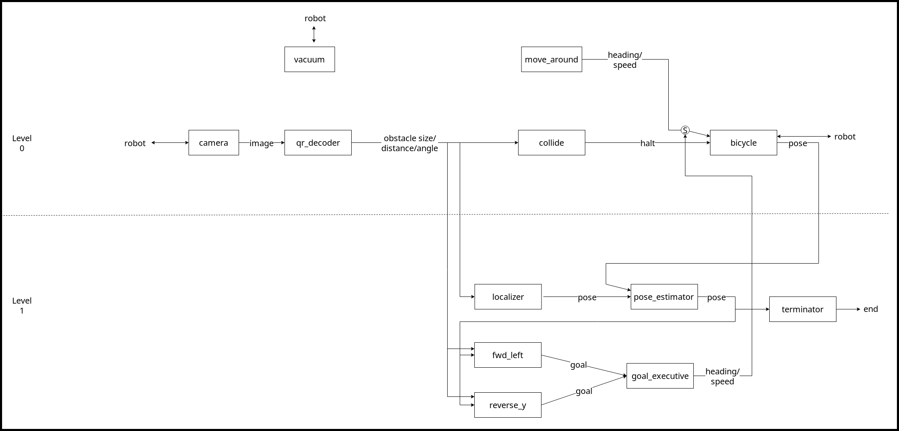

# Introduction

In this homework I wrote an architecture-first system for the PiCar Vacuum which can "clean" a specific patch of floor with performance guarantees. Some salient (new in this homework) features include:

1. One-to-one mapping of modules. Each module in the architecture diagram has a corresponding python module. The contents of each module may seem strange at first, but I've tried to make them as close to the architecture as possible.
2. Concurrent image processing. In the previous few homeworks, the time it took to capture images and scan QR codes caused issues (that were sidestepped inelegantly). Now that is done by a separate process (finally!), and the overall system is much smoother as a result.
3. Better design. Previously, my bicycle model not only dealt with the Kinematics but also calculated the control inputs and a few other things. Similarly, many classes performed moteley tasks. Now, each class/module has only one logical function.

# Architecture

The architecture is similar to layered subsumption architecture by Rodney Brooks [1](http://mrsl.rice.edu/sites/mrsl.rice.edu/files/BehaviorSystem.pdf). I've tried to incorporate many design priciples from his paper:

1. Requirements.
  1. Multiple goals: I have different modules that can have conflicting goals (moving forward-and-left, moving in reverse) but they are always appropriately resolved.
  2. Robustness: My system is divided into two levels. Even if for some reason level 1 stops functioning, the robot will still continue its vacuuming and cleaning.
2. Simplicity. I just have two key behaviours (forward-left and reverse-y) with which I can provide a performance guarantee.
3. Using visual data (I had no choice in the matter!).
4. Levels of competence. My robot has two levels of competence (level 0 and level 1). Though the exact function of my levels are a bit different.
5. Layers of control/subsumption. Level 1 behaviours subsume the move_around behaviour from level 0.

# Behaviours

The two key behaviours I have are